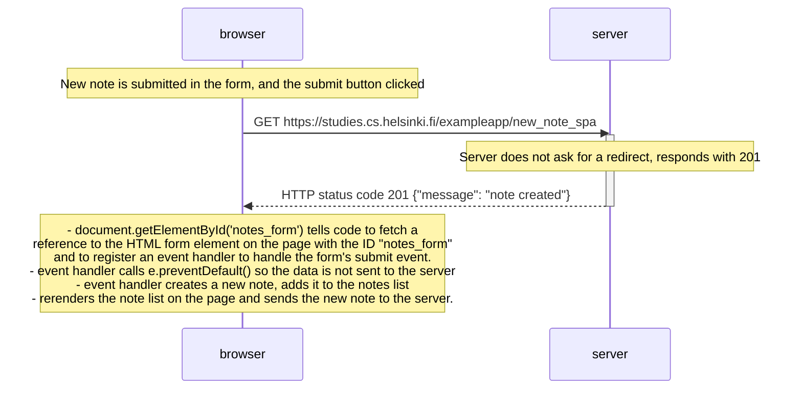

```mermaid
sequenceDiagram
    participant browser
    participant server

    note over browser: New note is submitted in the form, and the submit button clicked


    browser->>server: GET https://studies.cs.helsinki.fi/exampleapp/new_note_spa
    activate server

    note over server: Server does not ask for a redirect, responds with 201

    server-->>browser: HTTP status code 201 {"message": "note created"}
    deactivate server
    note over browser: - document.getElementById('notes_form') tells code to fetch a <br> reference to the HTML form element on the page with the ID "notes_form" <br> and to register an event handler to handle the form's submit event. <br> - event handler calls e.preventDefault() so the data is not sent to the server <br> - event handler creates a new note, adds it to the notes list<br> - rerenders the note list on the page and sends the new note to the server.
```
